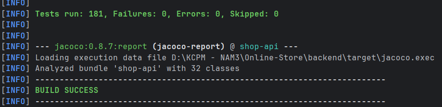

# WHITE-BOX TESTING – COVERAGE REPORT

## 1. Coverage theo từng Service Class (Unit Test – `mvn test`)

Kết quả đo Coverage được thực hiện bằng JaCoCo **sau khi chạy toàn bộ Unit Test** (`mvn test` + `mvn jacoco:report`).

Hai chỉ số chính:

* **Statement / Line Coverage:** tỷ lệ câu lệnh / dòng code được thực thi.
* **Branch / Decision Coverage:** tỷ lệ nhánh điều kiện được thực thi.

| Service Class             | Statement % | Branch % |
|---------------------------|------------:|---------:|
| ProductServiceImpl        |    **100%** | **100%** |
| CartServiceImpl           |    **100%** | **100%** |
| OrderServiceImpl          |    **100%** | **100%** |
| UserServiceImpl           |    **100%** |  **100%** |
| ProductInOrderServiceImpl |    **100%** |  **n/a** |
| CategoryServiceImpl       |    **100%** | **100%** |
| **Total (Service Layer)** |    **100%** | **100%** |

**Nhận xét:**

* Toàn bộ Service Layer đạt **100% Statement**; Branch đạt **100%** ở các class có nhánh được JaCoCo đo.
* `ProductServiceImpl` đạt 100% sau khi bổ sung unit test cho `findUpAll(Pageable)` và `findAllInCategory(Integer, Pageable)`.
* `ProductInOrderServiceImpl`: Branch = **n/a** trên báo cáo JaCoCo (không có nhánh điều kiện theo cách JaCoCo phân loại).
* `UserServiceImpl`: Statement **100%**, Branch **100%** (theo báo cáo hiện tại).

> **Lưu ý phân biệt:** Số % ở mục này chỉ phản ánh **Unit Test**. Coverage khi chạy API Black-box (Newman) nằm ở **mục 15** — hai nguồn đo **độc lập**.

---

## 2. Bằng chứng JaCoCo (Unit Test)

Báo cáo HTML Unit Test:

```text
backend/target/site/jacoco/index.html
```

*(Tạo bằng: `cd backend` → `mvn test` → `mvn jacoco:report`)*


**Hình 1.** Báo cáo JaCoCo sau Unit Test – Coverage theo Service Class.

---

## 3. Chi tiết ProductServiceImpl

`ProductServiceImpl` đạt:

* Statement / Line Coverage: **100%**
* Branch / Decision Coverage: **100%**
* Lines: **40/40**
* Methods: **12/12**

Hai method từng **0%** đã được bổ sung unit test và cover đầy đủ:

| Method | Test bổ sung |
|--------|----------------|
| `findUpAll(Pageable)` | `findUpAllTest` |
| `findAllInCategory(Integer, Pageable)` | `findAllInCategoryTest`, `findAllInCategoryEmptyPageTest` |


**Hình 2.** Chi tiết Coverage `ProductServiceImpl` (không còn method 0%).

---

## 4. Kết quả Unit Test

```text
mvn test
```

```text
Tests run: 181
Failures: 0
Errors: 0
Skipped: 0
```



**Hình 3.** Kết quả Maven Unit Test.

| Hạng mục | Giá trị |
|----------|---------|
| Tổng số test | **181** |
| Failures | **0** |
| Errors | **0** |
| Skipped | **0** |

Tạo báo cáo:

```text
mvn jacoco:report
```

Path HTML Unit:

```text
backend/target/site/jacoco/index.html
```

---

# PHẦN BỔ SUNG — WHITE-BOX TESTING (CHƯƠNG 4)

> Bổ sung: **CFG**, **Cyclomatic Complexity**, **Independent Paths**, **Condition Coverage**, **Branch-Condition Coverage**, **Branch Condition Combination Coverage**.
>
> Sau khi bổ sung `cancelProductInfoNotFoundTest()` và các test liên quan, `OrderServiceImpl` / `CartServiceImpl` đạt **100% Branch** (Service Layer) theo JaCoCo Unit.

## 5. Lựa chọn method & phạm vi

Nhóm phân tích:

- `OrderServiceImpl.finish()`
- `OrderServiceImpl.cancel()`
- `CartServiceImpl.mergeLocalCart()`

Ba method trên chủ yếu dùng **điều kiện đơn** → Condition Coverage trùng Branch Coverage.

Để minh họa Condition / Branch-Condition / BCC Combination, bổ sung:

- `CartServiceImpl.delete(String itemId, User user)` — điều kiện ghép `A || B`.

---

## 5.1. `OrderServiceImpl.finish(Long orderId)`

**Source (rút gọn theo node):**

```java
public OrderMain finish(Long orderId) {
    OrderMain orderMain = findOne(orderId);                                   // N1
    if (!orderMain.getOrderStatus().equals(OrderStatusEnum.NEW.getCode())) { // N2
        throw new MyException(ResultEnum.ORDER_STATUS_ERROR);                 // N3
    }
    orderMain.setOrderStatus(OrderStatusEnum.FINISHED.getCode());
    orderRepository.save(orderMain);                                         // N4
    return orderRepository.findByOrderId(orderId);                           // N5
}
```


| Thành phần | Giá trị |
|------------|---------|
| Decision | N2 (1) |
| V(G) | E − N + 2 = 2 = P + 1 |

| Path | Điều kiện | Test Case |
|------|-----------|-----------|
| F-P1 | status ≠ NEW → exception | `finishStatusCanceledTest`, `finishStatusFinishedTest` |
| F-P2 | status = NEW → success | `finishSuccessTest` |

---

## 5.2. `OrderServiceImpl.cancel(Long orderId)`


| Thành phần | Giá trị |
|------------|---------|
| Decision | D1 status, D2 loop, D3 `productInfo != null` → P = 3 |
| V(G) | 4 |

| Path | Điều kiện | Test Case |
|------|-----------|-----------|
| C-P1 | status ≠ NEW | `cancelStatusCanceledTest`, `cancelStatusFinishTest` |
| C-P2 | status = NEW, products rỗng | `cancelNoProduct` |
| C-P3 | productInfo ≠ null → `increaseStock` | `cancelSuccessTest` |
| C-P4 | productInfo == null | **`cancelProductInfoNotFoundTest`** (bổ sung) |

Trước khi có C-P4, Branch của `cancel()` còn gap ở nhánh `productInfo == null`.

---

## 5.3. `CartServiceImpl.mergeLocalCart(...)`


| Path | Điều kiện | Test Case |
|------|-----------|-----------|
| M-P1 | collection **rỗng** | **`mergeLocalCartEmptyCollectionTest`** |
| M-P2 | sản phẩm đã có trong cart | `mergeLocalCartTest`, `mergeLocalCartTwoProductTest` |
| M-P3 | sản phẩm chưa có | `mergeLocalCartNoProductTest` |

V(G) = 3. Path M-P1 đã có unit test riêng.

---

## 5.4. `CartServiceImpl.delete(String itemId, User user)`


```java
if (itemId.equals("") || user == null) {  // A || B
    throw new MyException(ResultEnum.ORDER_STATUS_ERROR);
}
```

| Ký hiệu | Biểu thức |
|---------|-----------|
| A | `itemId.equals("")` |
| B | `user == null` |

---

## 5.5. Unit Test đã bổ sung (tóm tắt)

| Mục đích | Test / vị trí |
|----------|----------------|
| Path C-P4 cancel | `cancelProductInfoNotFoundTest` – `OrderServiceImplTest` |
| Cart checkout nhánh null/empty | `checkoutCartNullTest`, `checkoutProductsNullTest`, `checkoutEmptyProductsTest` |
| merge collection rỗng | `mergeLocalCartEmptyCollectionTest` |
| Product 0% → 100% | `findUpAllTest`, `findAllInCategoryTest`, … – `ProductServiceImplTest` |
| Khác | `getCartTest`, test exception cause chain – `UserServiceImplTest` |

---

## 6. Statement Coverage

Đối chiếu CFG mục 5: các statement-node của `finish` / `cancel` / `mergeLocalCart` / `delete` đều được thực thi ít nhất một lần → **không còn gap Statement** ở các method phân tích (khớp Service Layer 100% Statement trên JaCoCo Unit).

---

## 7. Branch / Decision Coverage

| Method | Decision | True | False |
|--------|----------|------|-------|
| `finish()` | status ≠ NEW | `finishStatusCanceledTest`, `finishStatusFinishedTest` | `finishSuccessTest` |
| `cancel()` | D1 status ≠ NEW | cancel status tests | success / noProduct / productInfoNotFound |
| `cancel()` | D2 loop | success, productInfoNotFound | `cancelNoProduct` |
| `cancel()` | D3 productInfo ≠ null | `cancelSuccessTest` | **`cancelProductInfoNotFoundTest`** |
| `mergeLocalCart()` | forEach còn phần tử | merge* có item | **`mergeLocalCartEmptyCollectionTest`** |
| `mergeLocalCart()` | old.isPresent() | merge trùng SP | `mergeLocalCartNoProductTest` |
| `delete()` | A \|\| B | `deleteNoProductTest`, `deleteNoUserTest` | `deleteTest` |

---

## 8. Condition Coverage (`delete`: A \|\| B)

| Condition | T | F |
|-----------|---|---|
| A (`itemId.equals("")`) | `deleteNoProductTest` | `deleteTest`, `deleteNoUserTest` |
| B (`user == null`) | `deleteNoUserTest` | `deleteTest` |

Khi A = T, B không được evaluate (short-circuit) → không gán evidence B trong lần gọi đó.

→ Condition Coverage đạt cho các giá trị **thực sự được evaluate**.

---

## 9. Branch-Condition Coverage

| Condition | Result | Branch tổng | Test | Bằng chứng |
|-----------|--------|-------------|------|-----------|
| A = T | T | throw | `deleteNoProductTest` | expected `MyException` |
| A = F, B = T | T | throw | `deleteNoUserTest` | expected `MyException` |
| A = F, B = F | F | xóa item | `deleteTest` | `verify(...).deleteById` |
| productInfo ≠ null | T/F | increaseStock / không | `cancelSuccessTest` / `cancelProductInfoNotFoundTest` | `verify` / `never()` |

---

## 10. Branch Condition Combination Coverage (`A || B`)

| A | B | Overall | Test | Covered? |
|---|---|---------|------|----------|
| T | T | T | — | **Không** (short-circuit: A=T thì B không evaluate) |
| T | F | T | `deleteNoProductTest` | Có |
| F | T | T | `deleteNoUserTest` | Có |
| F | F | F | `deleteTest` | Có |

Tổ hợp TT không có execution evidence độc lập → **không đánh dấu Covered**.

---

## 11. Data Flow (tham khảo)

| Biến | Def | Use | Ghi chú |
|------|-----|-----|---------|
| `orderMain` | findOne | điều kiện, setStatus, getProducts | def-use hợp lệ |
| `productInfo` | findByProductId | `!= null` | mỗi vòng lặp |
| `prod` (merge) | nhánh if/else | save | hai def loại trừ nhau |

Không phát hiện anomaly def-use bắt buộc phải thêm test chỉ cho hình thức.

---

## 12. `@Valid` và Validation Flow

* **ProductController:** endpoint ghi dùng `@Valid` → Bean Validation chặn sớm (400).
* **UserController** (`register` / `profile`) và **CartController** (`merge` / `add` / `modify`): **thiếu `@Valid`** trên một số `@RequestBody` → dữ liệu invalid có thể lọt xuống Service nếu Service không tự validate.

Unit test BVA (Bean Validation trên entity/form) và thực tế API cho thấy khoảng trống nhất quán validation giữa Product và User/Cart.

**Đề xuất (không bắt buộc trong phạm vi chỉ đo coverage):** thêm `@Valid` + annotation `@Size` / `@Min` / `@Positive` tương ứng trên User, ItemForm, v.v.

---

## 13. Đối chiếu CFG thủ công vs JaCoCo Unit

| Method | Statement (Unit) | Branch (Unit) | CFG / Path | Kết luận |
|--------|------------------|---------------|------------|----------|
| `finish()` | 100% class | 100% class | 2/2 path | Đủ |
| `cancel()` | 100% class | 100% class | 4/4 path (có C-P4) | Đủ sau bổ sung test |
| `mergeLocalCart()` | 100% class | 100% class | 3/3 path (có M-P1) | Đủ |
| `delete()` | trong 100% class | trong 100% class | Condition/BCC (trừ TT short-circuit) | Khớp |

**Tổng Unit:** **181** tests, **0** fail; Service Layer **100%** Statement / Branch (nơi đo được).

---

## 14. Mapping Test Case ↔ Path / Branch / Condition

| Method | Path / Branch / Condition | Test Case |
|--------|---------------------------|-----------|
| finish | status ≠ NEW | `finishStatusCanceledTest`, `finishStatusFinishedTest` |
| finish | status = NEW | `finishSuccessTest` |
| cancel | status ≠ NEW | `cancelStatusCanceledTest`, `cancelStatusFinishTest` |
| cancel | products rỗng | `cancelNoProduct` |
| cancel | productInfo ≠ null | `cancelSuccessTest` |
| cancel | productInfo == null | `cancelProductInfoNotFoundTest` |
| mergeLocalCart | collection rỗng | `mergeLocalCartEmptyCollectionTest` |
| mergeLocalCart | SP đã có | `mergeLocalCartTest`, `mergeLocalCartTwoProductTest` |
| mergeLocalCart | SP chưa có | `mergeLocalCartNoProductTest` |
| delete | A = T | `deleteNoProductTest` |
| delete | A = F, B = T | `deleteNoUserTest` |
| delete | A = F, B = F | `deleteTest` |

Chi tiết Excel: `Docs/QA-Testing/Test_Case_WhiteBox.xlsx`.

---

# 15. API Black-box Execution Coverage (Newman + JaCoCo)

> **Phân biệt bắt buộc — không trộn với Unit**
>
> | | **Unit Test** (`mvn test`) | **Black-box Newman** |
> |--|---------------------------|----------------------|
> | HTML | `backend/target/site/jacoco/index.html` | `jacoco-bb-report/index.html` |
> | `service.impl` | **100%** | ~**75%** |
> | `api` (Controller) | ~**4%** (gần như không chạy) | ~**94%** |
> | `security.JWT` | ~**0%** | ~**93%** |
> | Total Instruction (toàn project) | ~31% (nếu xem Total Unit) | **39%** |
> | Total Branch | ~10% | **10%** |
>
> Ảnh / số liệu Unit toàn project (api thấp, service 100%) **không** được ghi là kết quả Newman.

Thiết kế Postman/Newman vẫn là **Black-box**. % dưới đây là **structural coverage** khi execute collection trên backend có JaCoCo agent.

### Cách đo (đã thực hiện)

1. `docker-compose`: agent  
   `output=tcpserver,address=*,port=6300` + port **6300** + volume `./jacoco:/jacoco`
2. `docker compose up -d backend` → **Newman full** collection  
3. Backend **còn Up**:  
   `java -jar jacoco/jacococli.jar dump --address localhost --port 6300 --destfile jacoco/jacoco.exec`
4.  
   `java -jar jacoco/jacococli.jar report jacoco/jacoco.exec --classfiles backend/target/classes --sourcefiles backend/src/main/java --html jacoco-bb-report --xml jacoco-bb-report/jacoco.xml`

### Kết quả Black-box (từ `jacoco-bb-report/index.html`)

| Metric | Newman API Execution |
|--------|---------------------:|
| Statement / Instruction Coverage | **39%** |
| Branch Coverage | **10%** |
| Line Coverage (tham khảo) | ~69% |
| Method Coverage (tham khảo) | ~47% |
| Class Coverage (tham khảo) | ~81% |

| Hạng mục | Giá trị |
|----------|---------|
| Ngày đo | 2026-09-14 |
| Ghi chú | Một số assertion Newman fail (cart/order state) — vẫn đo được coverage phần code đã chạy |

### Coverage theo package khi chạy Newman (BB)

| Package | Instruction (BB) | Ý nghĩa |
|---------|------------------|---------|
| `me.zhulin.shopapi.api` | ~**94%** | Controller được HTTP hit |
| `me.zhulin.shopapi.security.JWT` | ~**93%** | Login / token |
| `me.zhulin.shopapi.service.impl` | ~**75%** | Business qua API (không bằng Unit 100%) |
| `me.zhulin.shopapi.entity` | ~**3%** | Chủ yếu getter/setter |
| **Total** | **39%** | Toàn bộ classfiles trong report |

*(Số package lấy từ báo cáo BB `jacoco-bb-report`; Total bắt buộc khớp **39% / 10%**.)*

### Đường dẫn report

| Report | Path |
|--------|------|
| Newman HTML | `postman/newman-report/API_Test_Report.html` |
| **JaCoCo HTML — Black-box** | **`jacoco-bb-report/index.html`** |
| JaCoCo exec — Black-box | `jacoco/jacoco.exec` |
| JaCoCo HTML — Unit only | `backend/target/site/jacoco/index.html` |


**Hình 4.** JaCoCo **sau Newman** (phải thấy api/JWT cao, Total ~39% Instruction — **không** dùng ảnh Unit Total 31% với api 4%).

### Nhận xét

* Unit cố ý cover hết nhánh **Service** → `service.impl` **100%**.  
* Newman đi theo luồng API → **Controller + JWT** cao, Service chỉ ~75%, Total project **39%** Instruction.  
* Hai số **không** thay thế nhau; không sửa unit test để “làm đẹp” % BB.

---

## 16. Tóm tắt hai nguồn coverage

| Nguồn | Instruction | Branch | Path HTML | Dấu hiệu nhận biết |
|-------|-------------|--------|-----------|-------------------|
| **Unit – Service Layer** | **100%** | **100%** | `backend/target/site/jacoco/...` (package service.impl) | Mọi `*ServiceImpl` xanh 100% |
| **Unit – toàn project (Total)** | ~**31%** | ~**10%** | cùng report Unit, view Total | api/JWT gần 0% |
| **Black-box Newman** | **39%** | **10%** | `jacoco-bb-report/index.html` | api/JWT rất cao |

**Kết luận:** Đã tách Unit (CFG + 181 tests + Service 100%) và BB Newman (39% / 10%, path riêng). Ảnh mục 15 **phải** lấy từ `jacoco-bb-report`, không lấy Total Unit.