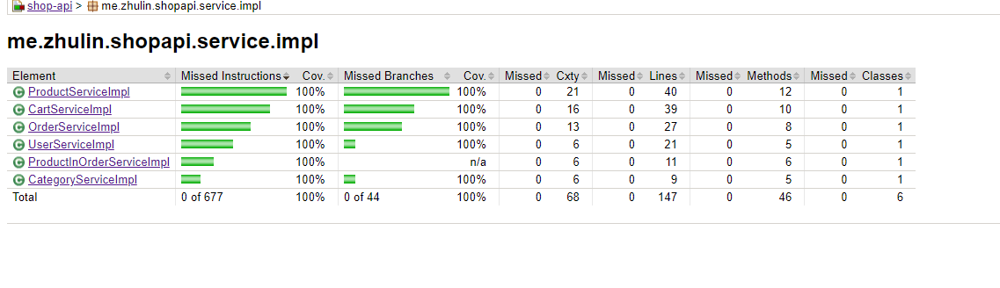
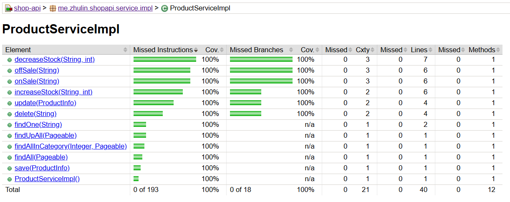
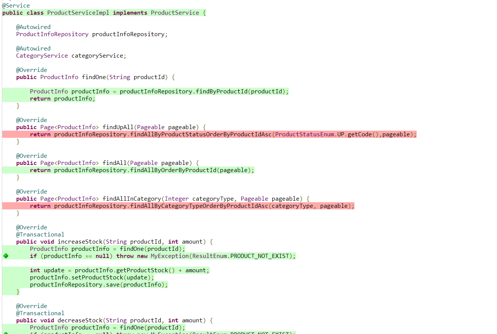
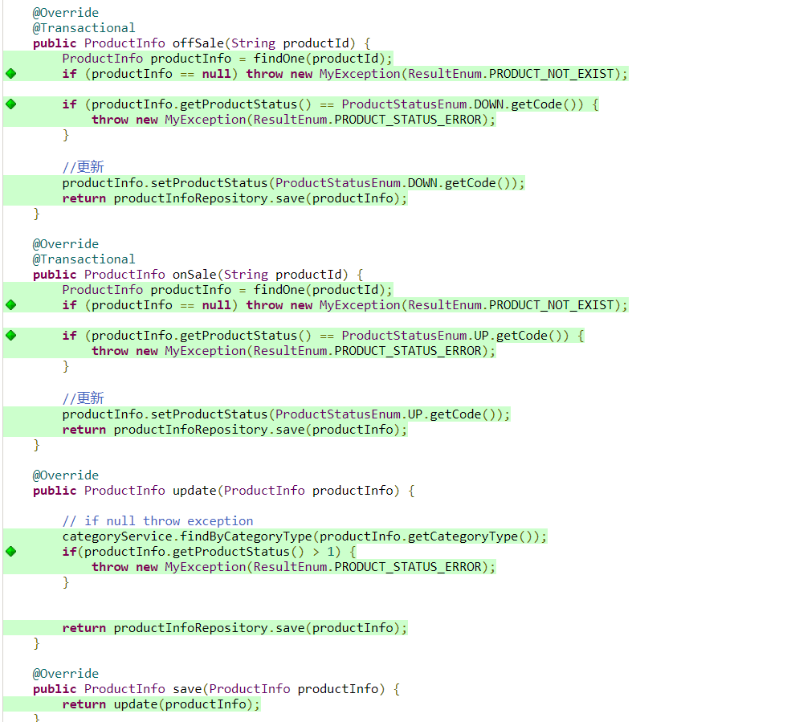
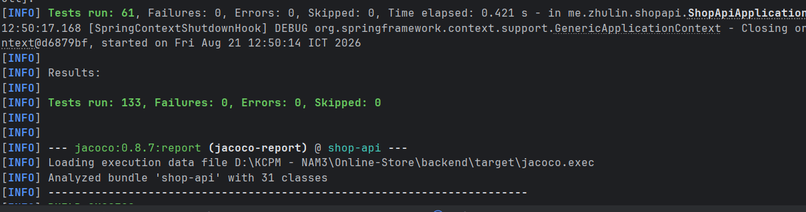

# WHITE-BOX TESTING – COVERAGE REPORT

## 1. Coverage theo từng Service Class

Kết quả đo Coverage được thực hiện bằng JaCoCo sau khi chạy toàn bộ Unit Test. Hai chỉ số được sử dụng gồm:

* **Statement / Line Coverage:** tỷ lệ các câu lệnh/dòng code được thực thi.
* **Branch / Decision Coverage:** tỷ lệ các nhánh điều kiện được thực thi.

| Service Class             | Statement % | Branch % |
|---------------------------|------------:|---------:|
| ProductServiceImpl        |     **93%** | **100%** |
| CartServiceImpl           |    **100%** | **100%** |
| OrderServiceImpl          |    **100%** |  **90%** |
| UserServiceImpl           |    **100%** |  **n/a** |
| ProductInOrderServiceImpl |    **100%** |  **n/a** |
| CategoryServiceImpl       |    **100%** | **100%** |
| Total                     |     **97%** |  **97%** |

**Nhận xét:**

* `CartServiceImpl` đạt 100% Statement Coverage và 100% Branch Coverage.
* `OrderServiceImpl` đạt 100% Statement Coverage và 90% Branch Coverage, nghĩa là vẫn còn một số nhánh điều kiện chưa được thực thi.
* `ProductServiceImpl` đạt 93% Statement Coverage và 100% Branch Coverage.
* `UserServiceImpl` và `ProductInOrderServiceImpl` đạt 100% Statement Coverage. Branch Coverage được JaCoCo ghi nhận là `n/a` do class không có branch có thể đo theo báo cáo.
* `CategoryServiceImpl` đạt 100% Statement Coverage và 100% Branch Coverage.

## 2. Bằng chứng JaCoCo

Báo cáo JaCoCo được tạo tại:

```text
target/site/jacoco/index.html
```


**Hình 1. Báo cáo JaCoCo tổng quan – Coverage theo từng Service Class**

Ảnh cần thể hiện rõ các Service Class và phần trăm Coverage tương ứng.

## 3. Chi tiết ProductServiceImpl

`ProductServiceImpl` đạt:

* Statement / Line Coverage: **93%**
* Branch / Decision Coverage: **100%**
* Lines: **38/40**
* Methods: **10/12**

Theo báo cáo JaCoCo, hai method chưa được thực thi là:

```text
findUpAll(Pageable)
findAllInCategory(Integer, Pageable)
```

Hai method này có Coverage bằng 0%.



**Hình 3.4. Chi tiết Coverage của ProductServiceImpl trong JaCoCo**

## 4. Kết quả Unit Test

Toàn bộ Unit Test được thực thi bằng Maven:

```text
mvn test
```

Kết quả:

```text
Tests run: 133
Failures: 0
Errors: 0
Skipped: 0
```

Do đó:

* Tổng số Test: **133**
* Failure: **0**
* Error: **0**
* Skipped: **0**




**Hình 5. Kết quả chạy 133 Unit Test bằng Maven**


Sau khi Unit Test hoàn thành, báo cáo JaCoCo được tạo bằng:

```text
mvn jacoco:report
```

Kết quả:

```text
BUILD SUCCESS
```

Báo cáo HTML được tạo tại:

```text
target/site/jacoco/index.html
```
