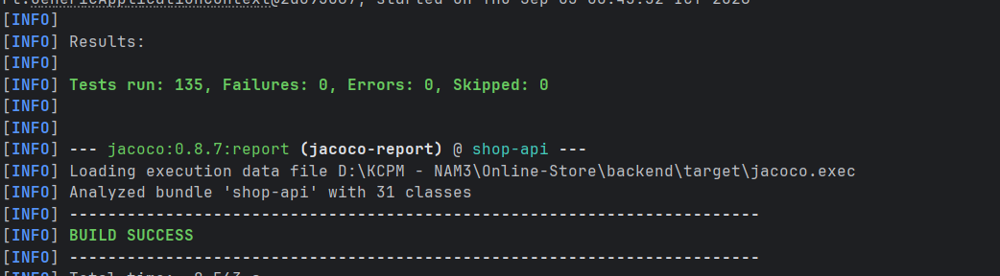
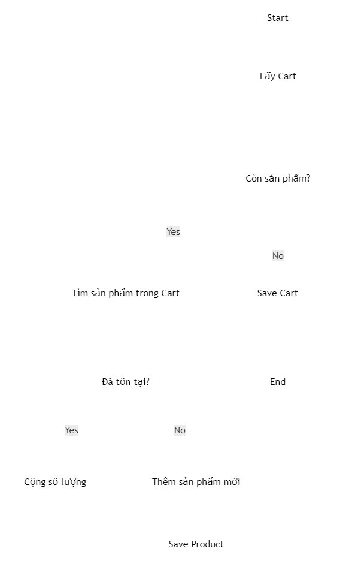
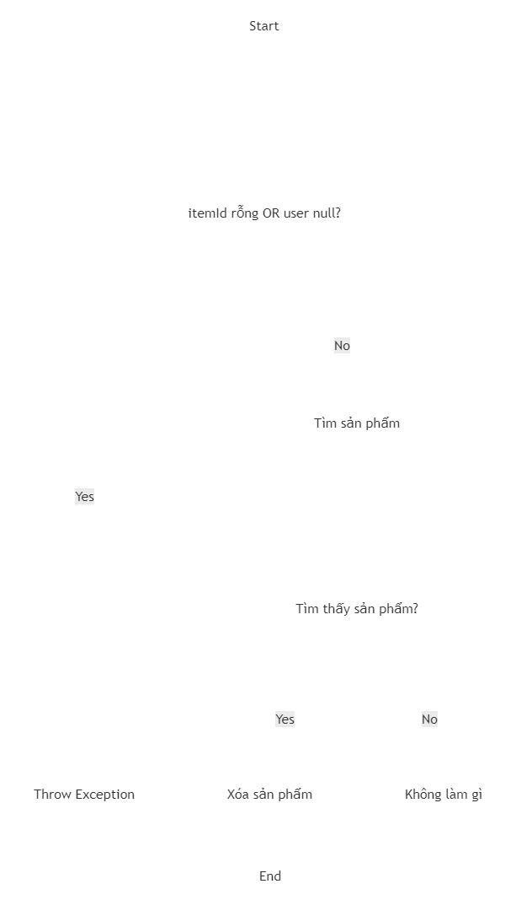
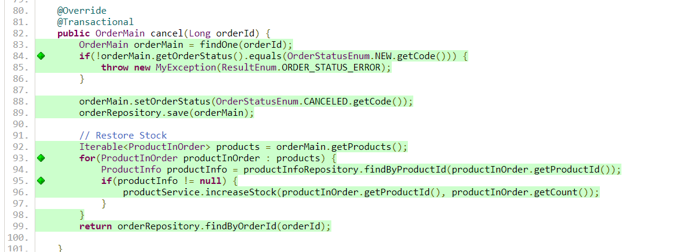

# WHITE-BOX TESTING – COVERAGE REPORT

## 1. Coverage theo từng Service Class

Kết quả đo Coverage được thực hiện bằng JaCoCo sau khi chạy toàn bộ Unit Test. Hai chỉ số được sử dụng gồm:

* **Statement / Line Coverage:** tỷ lệ các câu lệnh/dòng code được thực thi.
* **Branch / Decision Coverage:** tỷ lệ các nhánh điều kiện được thực thi.

| Service Class             | Statement % | Branch % |
|---------------------------|------------:|---------:|
| ProductServiceImpl        |     **93%** | **100%** |
| CartServiceImpl          |    **100%** | **100%** |
| OrderServiceImpl          |    **100%** | **100%** |
| UserServiceImpl           |    **100%** |  **n/a** |
| ProductInOrderServiceImpl |    **100%** |  **n/a** |
| CategoryServiceImpl       |    **100%** | **100%** |
| Total                     |     **97%** | **100%** |

**Nhận xét:**

* `CartServiceImpl` đạt 100% Statement Coverage và 100% Branch Coverage.
* `OrderServiceImpl` đạt 100% Statement Coverage và 100% Branch Coverage.
* `ProductServiceImpl` đạt 93% Statement Coverage và 100% Branch Coverage.
* `UserServiceImpl` và `ProductInOrderServiceImpl` đạt 100% Statement Coverage. Branch Coverage được JaCoCo ghi nhận là `n/a` do class không có branch có thể đo theo báo cáo.
* `CategoryServiceImpl` đạt 100% Statement Coverage và 100% Branch Coverage.

## 2. Bằng chứng JaCoCo

Báo cáo JaCoCo được tạo tại:

```text
target/site/jacoco/index.html
```


**Hình 1. Báo cáo JaCoCo tổng quan – Coverage theo từng Service Class**

Ảnh cần thể hiện rõ các Service Class và phần trăm Coverage tương ứng.

## 3. Chi tiết ProductServiceImpl

`ProductServiceImpl` đạt:

* Statement / Line Coverage: **93%**
* Branch / Decision Coverage: **100%**
* Lines: **38/40**
* Methods: **10/12**

Theo báo cáo JaCoCo, hai method chưa được thực thi là:

```text
findUpAll(Pageable)
findAllInCategory(Integer, Pageable)
```

Hai method này có Coverage bằng 0%.


**Hình 3.4. Chi tiết Coverage của ProductServiceImpl trong JaCoCo**

## 4. Kết quả Unit Test

Toàn bộ Unit Test được thực thi bằng Maven:

```text
mvn test
```

Sau khi bổ sung Unit Test mới (xem Mục 5.5), chạy lại mvn test:
```text
Tests run: 135
Failures: 0
Errors: 0
Skipped: 0
```


Do đó:

* Tổng số Test: **135**
* Failure: **0**
* Error: **0**
* Skipped: **0**


Sau khi Unit Test hoàn thành, báo cáo JaCoCo được tạo bằng:

```text
mvn jacoco:report
```

Kết quả:

```text
BUILD SUCCESS
```

Báo cáo HTML được tạo tại:

```text
target/site/jacoco/index.html
```


# PHẦN BỔ SUNG — WHITE-BOX TESTING NÂNG CAO (CHƯƠNG 4)

> Phần này bổ sung các kỹ thuật **White-box Testing** còn thiếu, gồm: **Control Flow Graph (CFG)**, **Cyclomatic Complexity**, **Independent Paths**, **Condition Coverage**, **Branch-Condition Coverage** và **Branch Condition Combination Coverage**.
> Sau khi bổ sung `cancelProductInfoNotFoundTest()` và chạy lại toàn bộ Unit Test, JaCoCo ghi nhận `OrderServiceImpl` đạt **100% Branch Coverage**.
## 5. Lựa chọn Method & phạm vi áp dụng

Nhóm ưu tiên 3 method:

- `OrderServiceImpl.finish()`
- `OrderServiceImpl.cancel()`
- `CartServiceImpl.mergeLocalCart()`

Ba method này được sử dụng để phân tích **Control Flow Graph (CFG)**, **Cyclomatic Complexity** và **Independent Paths**, đáp ứng yêu cầu phân tích ít nhất 2 method.

Tuy nhiên, khi kiểm tra source code, cả 3 method trên chủ yếu sử dụng **điều kiện đơn**, ví dụ:

- `!status.equals(NEW)`
- `productInfo != null`
- `old.isPresent()`

Các điều kiện này không sử dụng điều kiện ghép `&&` hoặc `||`. Vì vậy, **Condition Coverage** trong các trường hợp này có ý nghĩa tương đương với **Branch Coverage** và không phù hợp để minh họa **Branch Condition Combination Coverage**.

Để phân tích đầy đủ các loại Coverage trên, nhóm bổ sung method:

`CartServiceImpl.delete(String itemId, User user)`

Method này có điều kiện ghép:

```java
if (itemId.equals("") || user == null) {
        throw new MyException(ResultEnum.ORDER_STATUS_ERROR);
}
```
---

## 5.1. Method 1 — `OrderServiceImpl.finish(Long orderId)`
Đây là hàm dùng khi shop xác nhận 1 đơn hàng đã hoàn tất.

**Source code:**

```java
public OrderMain finish(Long orderId) {
    OrderMain orderMain = findOne(orderId);                                   // N1
    if(!orderMain.getOrderStatus().equals(OrderStatusEnum.NEW.getCode())) {   // N2 (decision)
        throw new MyException(ResultEnum.ORDER_STATUS_ERROR);                 // N3
    }
    orderMain.setOrderStatus(OrderStatusEnum.FINISHED.getCode());
    orderRepository.save(orderMain);                                         // N4
    return orderRepository.findByOrderId(orderId);                           // N5
}
```

**Control Flow Graph:**


**Nodes / Edges / Decision / Entry-Exit:**

| Thành phần | Danh sách |
|---|---|
| Entry | N1 |
| Exit | N3 (exception), N5 (return) — gộp chung 1 nút Exit |
| Nodes (N) | N1, N2, N3, N4, N5, Entry, Exit → **N = 7** |
| Decision node | N2 (`if`) → **1 decision** |
| Edges (E) | N1→N2, N2→N3(T), N2→N4(F), N3→Exit, N4→N5, N5→Exit, Entry→N1 → **E = 7** |

**Cyclomatic Complexity:**

```
V(G) = E - N + 2 = 7 - 7 + 2 = 2
V(G) = P + 1      = 1 + 1     = 2   (khớp)
```

**Independent Paths (2):**

| Path ID | Chuỗi Node | Điều kiện | Test Case |
|---|---|---|---|
| F-P1 | Entry-N1-N2-N3-Exit | Order status ≠ NEW → ném `MyException` | `finishStatusCanceledTest`, `finishStatusFinishedTest` |
| F-P2 | Entry-N1-N2-N4-N5-Exit | Order status == NEW → finish thành công | `finishSuccessTest` |

Ghi chú: `finishOrderNotFoundTest` (orderId không tồn tại) thực thi nhánh
exception **bên trong** `findOne()` — đây là CFG của `findOne()`, không phải
decision node của `finish()`, nên không tạo thêm Independent Path mới cho
`finish()` (được liệt kê để đầy đủ bằng chứng test nhưng không tính vào
V(G) của `finish()`).

---

## 5.2. Method 2 — `OrderServiceImpl.cancel(Long orderId)`
Đây là hàm huỷ đơn hàng và hoàn lại tồn kho cho từng sản phẩm trong đơn.

**Source code:**

```java
public OrderMain cancel(Long orderId) {
    OrderMain orderMain = findOne(orderId);                                   // N1
    if(!orderMain.getOrderStatus().equals(OrderStatusEnum.NEW.getCode())) {   // N2 (decision D1)
        throw new MyException(ResultEnum.ORDER_STATUS_ERROR);                 // N3
    }
    orderMain.setOrderStatus(OrderStatusEnum.CANCELED.getCode());
    orderRepository.save(orderMain);
    Iterable<ProductInOrder> products = orderMain.getProducts();              // N4
    for(ProductInOrder productInOrder : products) {                          // N5 (decision D2 - loop)
        ProductInfo productInfo = productInfoRepository.findByProductId(productInOrder.getProductId()); // N6
        if(productInfo != null) {                                            // N7 (decision D3)
            productService.increaseStock(productInOrder.getProductId(), productInOrder.getCount());     // N8
        }
    }
    return orderRepository.findByOrderId(orderId);                           // N9
}
```
**Control Flow Graph:**


**Nodes / Edges / Decision / Entry-Exit:**

| Thành phần | Danh sách |
|---|---|
| Entry | N1 |
| Exit | N3 (exception), N9 (return) — gộp 1 nút Exit |
| Nodes (N) | N1, N2, N3, N4, N5, N6, N7, N8, N9, Entry, Exit → **N = 10** (không tính Entry/Exit gộp riêng — xem chi tiết đếm bên dưới) |
| Decision node (P) | N2 (D1), N5 (D2 – loop condition), N7 (D3) → **P = 3** |
| Edges (E) | N1→N2, N2→N3(T), N2→N4(F), N3→Exit, N4→N5, N5→N6(T), N5→N9(F), N6→N7, N7→N8(T), N7→N5(F), N8→N5, N9→Exit, Entry→N1 → **E = 12** |

> Đếm N chính xác theo bảng Excel `WB-CFG-CyclomaticComplexity`: N1..N9 (9
> node lệnh/quyết định) + Entry + Exit tính gộp = **10 node**; E = **12 edge**
> (khớp với 3 decision node × 2 nhánh + các cạnh tuần tự + 2 cạnh loop-back).

**Cyclomatic Complexity:**

```
V(G) = E - N + 2 = 12 - 10 + 2 = 4
V(G) = P + 1      = 3 + 1       = 4   (khớp)
```

**Independent Paths (4 – Basis Path Set):**

| Path ID | Chuỗi Node | Điều kiện | Test Case |
|---|---|---|---|
| C-P1 | Entry-N1-N2-N3-Exit | Status ≠ NEW → ném `MyException` | `cancelStatusCanceledTest`, `cancelStatusFinishTest` |
| C-P2 | Entry-N1-N2-N4-N5-N9-Exit | Status = NEW, danh sách sản phẩm **rỗng** → loop 0 lần | `cancelNoProduct` |
| C-P3 | Entry-N1-N2-N4-N5-N6-N7-N8-N5-N9-Exit | Status = NEW, 1 sản phẩm, `productInfo` **tồn tại** → gọi `increaseStock()` | `cancelSuccessTest` |
| C-P4 | Entry-N1-N2-N4-N5-N6-N7-N5-N9-Exit | Status = NEW, 1 sản phẩm, `productInfo` **= null** (sản phẩm đã bị xoá) → **không** gọi `increaseStock()` | **`cancelProductInfoNotFoundTest` — Unit Test mới bổ sung (xem mục 5.5)** |

**Phát hiện quan trọng:** Trước khi bổ sung, **Path C-P4 chưa có test case
nào thực thi** — đây chính là nguyên nhân `OrderServiceImpl` chỉ đạt **90%
Branch Coverage** theo JaCoCo (mục 1). Nhánh `False` của decision D3
(`productInfo != null`) chưa từng được thực thi bởi test cũ (`cancelSuccessTest`
luôn mock `productInfo` tồn tại, `cancelNoProduct` không lặp qua phần tử nào).

---

## 5.3. Method 3 — `CartServiceImpl.mergeLocalCart(Collection<ProductInOrder>, User)`
Hàm này dùng khi người dùng đăng nhập và giỏ hàng lưu tạm ở trình duyệt (local cart) được gộp vào giỏ hàng chính thức trên server.

**Source code:**

```java
public void mergeLocalCart(Collection<ProductInOrder> productInOrders, User user) {
    Cart finalCart = user.getCart();                                          // N1
    productInOrders.forEach(productInOrder -> {                              // N2 (decision D1 - iteration)
        Set<ProductInOrder> set = finalCart.getProducts();
        Optional<ProductInOrder> old = set.stream()
                .filter(e -> e.getProductId().equals(productInOrder.getProductId()))
                .findFirst();                                                // N3
        ProductInOrder prod;
        if (old.isPresent()) {                                               // N4 (decision D2)
            prod = old.get();
            prod.setCount(productInOrder.getCount() + prod.getCount());      // N5
        } else {
            prod = productInOrder;
            prod.setCart(finalCart);
            finalCart.getProducts().add(prod);                               // N6
        }
        productInOrderRepository.save(prod);                                 // N7
    });
    cartRepository.save(finalCart);                                          // N8
}
```

**Control Flow Graph:**



**Nodes / Edges / Decision / Entry-Exit:**

| Thành phần | Danh sách |
|---|---|
| Entry | N1 |
| Exit | sau N8 |
| Nodes (N) | N1..N8 + Entry + Exit → **N = 9** (Entry gộp trước N1) |
| Decision node (P) | N2 (D1 – forEach iteration), N4 (D2) → **P = 2** |
| Edges (E) | Entry→N1, N1→N2, N2→N3(T), N2→N8(F), N3→N4, N4→N5(T), N4→N6(F), N5→N7, N6→N7, N7→N2(loop-back), N8→Exit → **E = 10** |

**Cyclomatic Complexity:**

```
V(G) = E - N + 2 = 10 - 9 + 2 = 3
V(G) = P + 1      = 2 + 1      = 3   (khớp)
```

**Independent Paths (3):**

| Path ID | Chuỗi Node | Điều kiện | Test Case |
|---|---|---|---|
| M-P1 | Entry-N1-N2-N8-Exit | `productInOrders` **rỗng** → forEach 0 lần | *Chưa có test case riêng (xem ghi chú)* |
| M-P2 | Entry-N1-N2-N3-N4-N5-N7-N2-N8-Exit | Có sản phẩm, sản phẩm **đã tồn tại** trong cart (`old.isPresent()=True`) → cộng dồn `count` | `mergeLocalCartTest`, `mergeLocalCartTwoProductTest` |
| M-P3 | Entry-N1-N2-N3-N4-N6-N7-N2-N8-Exit | Có sản phẩm, sản phẩm **chưa tồn tại** trong cart (`old.isPresent()=False`) → thêm mới | `mergeLocalCartNoProductTest` |

> **Ghi chú về M-P1:** M-P1 là trường hợp `productInOrders` rỗng, tức là vòng `forEach` không được thực hiện.
>
 Nhóm không tạo thêm Unit Test riêng cho trường hợp này vì `CartServiceImpl` đã đạt **100% Statement Coverage và 100% Branch Coverage** theo JaCoCo. Việc bổ sung thêm test chỉ để kiểm tra path này không làm thay đổi kết quả Coverage hiện tại.
 Tuy nhiên, M-P1 vẫn được liệt kê trong **Independent Paths** vì đây là một đường đi hợp lệ theo CFG. Điều này giúp thể hiện đầy đủ các đường đi có thể xảy ra trong method.
---

## 5.4. Method thay thế — `CartServiceImpl.delete(String itemId, User user)`

Method này được nhóm chọn thêm (xem lý do ở mục 5) vì có điều kiện ghép dùng ||, phù hợp để minh hoạ Condition Coverage / Branch-Condition Coverage / Branch Condition Combination Coverage.

```java
public void delete(String itemId, User user) {
    if(itemId.equals("") || user == null) {                                  // N2 (decision, A || B)
        throw new MyException(ResultEnum.ORDER_STATUS_ERROR);
    }
    var op = user.getCart().getProducts().stream()
            .filter(e -> itemId.equals(e.getProductId())).findFirst();
    op.ifPresent(productInOrder -> {
        productInOrder.setCart(null);
        productInOrderRepository.deleteById(productInOrder.getId());
    });
}
```

**CFG (tham khảo, không phải trọng tâm CC):**



N = 8, decision = 2 (N1 phức hợp A||B, N4 đơn) → E = 9 → V(G) = 9-8+2 = 3 = P+1
(2 decision node + 1). *(Không phải trọng tâm phân tích — trọng tâm của
method này là bảng Condition/Branch-Condition/BCC Combination ở mục 6-8.)*

**Atomic Conditions của decision N1:**

| Ký hiệu | Biểu thức | Ý nghĩa |
|---|---|---|
| A | `itemId.equals("")` | itemId rỗng |
| B | `user == null` | user chưa xác thực / null |
| Decision | `A \|\| B` | Nếu đúng → ném `MyException(ORDER_STATUS_ERROR)` |

---

## 5.5. Unit Test bổ sung (duy nhất)

Toàn bộ Unit Test cũ trong `OrderServiceImplTest.java` và `CartServiceImplTest.java` được **giữ nguyên 100%**. Chỉ **thêm mới 1 test method** vào cuối `OrderServiceImplTest.java` để cover Path **C-P4** (branch `productInfo == null` trong `cancel()`) — nguyên nhân của 90% Branch Coverage:

```java
@Test
public void cancelProductInfoNotFoundTest() {
    when(orderRepository.findByOrderId(orderMain.getOrderId()))
            .thenReturn(orderMain);

    when(productInfoRepository.findByProductId("1"))
            .thenReturn(null);

    OrderMain orderMainReturn =
            orderService.cancel(orderMain.getOrderId());

    assertThat(orderMainReturn.getOrderId(),
            is(orderMain.getOrderId()));

    assertThat(orderMainReturn.getOrderStatus(),
            is(OrderStatusEnum.CANCELED.getCode()));

    verify(productService, never()).increaseStock(any(), anyInt());
}
```

Vị trí: `backend/src/test/java/me/zhulin/shopapi/service/impl/OrderServiceImplTest.java`
(thêm sau `cancelOrderNotFoundTest()`, không đụng đến bất kỳ test nào khác).


---

## 6. Statement Coverage (bổ sung)

Statement Coverage hiện có ở mục 1 (JaCoCo) được **giữ nguyên**. Đối chiếu
thủ công theo CFG mục 5.1–5.3:

| Method | Tổng số statement-node | Đã cover bởi test cũ | Statement chưa cover trước khi bổ sung |
|---|---|---|---|
| `finish()` | N1, N3, N4, N5 (4 statement-node, chưa tính decision) | 4/4 (100%) | Không có |
| `cancel()` | N1, N3, N4, N6, N8, N9 (6 statement-node) | 6/6 (100%) | Không có — nhưng **N8 (`increaseStock`) chỉ được thực thi khi statement N6 trả về `productInfo != null`**, statement bản thân N6/N7 được cover ở cả 2 giá trị nhưng N8 chỉ cover 1 phía |
| `mergeLocalCart()` | N1, N3, N5, N6, N7, N8 (6 statement-node) | 6/6 (100%) | Không có |
| `delete()` | N2, N3, N5 (3 statement-node) | 3/3 (100%) | Không có |

Kết luận: **Statement Coverage không có gap** ở cả 4 method (khớp với JaCoCo
báo cáo `CartServiceImpl` 100% và `OrderServiceImpl` 100% Statement). Gap thực
sự nằm ở **Branch Coverage** (mục 7), không phải Statement Coverage — vì mọi
dòng lệnh đều được chạy ít nhất 1 lần, chỉ có 1 trong 2 nhánh của decision D3
(`cancel()`) là chưa từng chạy trước khi bổ sung `cancelProductInfoNotFoundTest`.

## 7. Branch / Decision Coverage (bổ sung)
Số liệu Branch Coverage ở mục 1 (JaCoCo) giữ nguyên. Bảng dưới liệt kê từng quyết định (mỗi if/vòng lặp) với 2 nhánh Đúng/Sai và test case tương ứng:

| Method | Decision | Nhánh True | Nhánh False |
|---|---|---|---|
| `finish()` | `!status.equals(NEW)` | `finishStatusCanceledTest`, `finishStatusFinishedTest` | `finishSuccessTest` |
| `cancel()` | D1: `!status.equals(NEW)` | `cancelStatusCanceledTest`, `cancelStatusFinishTest` | `cancelSuccessTest`, `cancelNoProduct`, `cancelProductInfoNotFoundTest` |
| `cancel()` | D2: loop còn phần tử? | `cancelSuccessTest`, `cancelProductInfoNotFoundTest` | `cancelNoProduct` |
| `cancel()` | D3: `productInfo != null` | `cancelSuccessTest` | `cancelProductInfoNotFoundTest` |
| `mergeLocalCart()` | D1: forEach còn phần tử? | `mergeLocalCartTest`, `mergeLocalCartTwoProductTest`, `mergeLocalCartNoProductTest` | *(chưa có test — path lý thuyết M-P1, xem giải thích mục 5.3)* |
| `mergeLocalCart()` | D2: `old.isPresent()` | `mergeLocalCartTest`, `mergeLocalCartTwoProductTest` | `mergeLocalCartNoProductTest` |
| `delete()` | `A \|\| B` (tổng thể) | `deleteNoProductTest`, `deleteNoUserTest` | `deleteTest` |

➡ Sau khi bổ sung `cancelProductInfoNotFoundTest`, **cả 3 decision của `cancel()` đều có đủ True/False**, Sau khi bổ sung Test Case, cần chạy lại JaCoCo để xác nhận Branch Coverage
thực tế.
## 8. Condition Coverage

Chỉ áp dụng ý nghĩa đầy đủ cho decision phức hợp `delete()`: `A || B`.

| Atomic Condition | Test Case | Giá trị |
|---|---|---|
| A: `itemId.equals("")` | `deleteNoProductTest` | **T** |
| A: `itemId.equals("")` | `deleteTest`, `deleteNoUserTest` | **F** |
| B: `user == null` | `deleteNoUserTest` | **T** |
| B: `user == null` | `deleteTest` | **F** |
| B: `user == null` | `deleteNoProductTest` | *(không evaluate do short-circuit khi A=T)* |

 A đạt cả T/F; B đạt cả T/F (khi thực sự được evaluate) → **Condition
Coverage = 100%** cho decision `A || B`, dựa trên 3 test case hiện có
(`deleteTest`, `deleteNoProductTest`, `deleteNoUserTest` — không cần thêm test
mới).

Với `finish()`, `cancel()` (D1, D3) và `mergeLocalCart()` (D2): mỗi decision
chỉ có **1 atomic condition duy nhất**, nên theo định nghĩa, **Condition
Coverage trùng hoàn toàn với Branch/Decision Coverage** đã trình bày ở mục 7 —
không cần lập bảng riêng (tránh trùng lặp không cần thiết).

## 9. Branch-Condition Coverage

Bảng này nối 4 thứ với nhau: điều kiện con → giá trị của nó → kết quả nhánh tổng thể → test case nào chứng minh.

Với delete() (điều kiện ghép):

| Atomic Condition | Condition Result | Branch Result (Overall) | Test Case | Bằng chứng thực thi |
|---|---|---|---|---|
| A = `itemId.equals("")` | T | True → throw `MyException` | `deleteNoProductTest` | `@Test(expected = MyException.class)` — test **pass** nghĩa là exception thực sự được ném |
| A = `itemId.equals("")`, B = `user==null` | A=F, B=T | True → throw `MyException` | `deleteNoUserTest` | `@Test(expected = MyException.class)` |
| A = `itemId.equals("")`, B = `user==null` | A=F, B=F | False → thực thi xoá item | `deleteTest` | `Mockito.verify(productInOrderRepository, times(1)).deleteById(...)` — verify xác nhận nhánh False thực sự chạy tới lệnh xoá |

Với `cancel()` decision D3 (`productInfo != null`, atomic đơn):

| Atomic Condition | Condition Result | Branch Result | Test Case | Bằng chứng thực thi |
|---|---|---|---|---|
| `productInfo != null` | T | True → gọi `increaseStock()` | `cancelSuccessTest` | `verify(productService).increaseStock("1", 10)` |
| `productInfo != null` | F | False → không gọi `increaseStock()` | `cancelProductInfoNotFoundTest` (mới) | `verify(productService, never()).increaseStock(any(), anyInt())` |

➡ Mỗi Test Case đều đi kèm **assertion/verify cụ thể chứng minh branch tương
ứng thực sự được thực thi**, không chỉ dựa vào việc test "pass".

## 10. Branch Condition Combination Coverage

Áp dụng cho decision phức hợp duy nhất trong phạm vi khảo sát:
`itemId.equals("") || user == null` (`CartServiceImpl.delete()`).

| Combination | A | B | Overall (A \|\| B) | Test Case | Covered? |
|---|---|---|---|---|---|
| TT | T | T | True | *Không có test riêng* | **Chưa cover** |
| TF | T | F | True | `deleteNoProductTest` | Covered |
| FT | F | T | True | `deleteNoUserTest` | Covered |
| FF | F | F | False | `deleteTest` | Covered |

**Giải thích tổ hợp TT chưa cover:** toán tử `||` trong Java là **short-circuit**
— khi `A = itemId.equals("") = true`, JVM **không evaluate B** nữa (`user ==
null` không được kiểm tra), nên về mặt thực thi, tổ hợp "A=T và B thực sự được
evaluate = T" **không thể tạo ra bằng chứng thực thi độc lập cho B** trong
cùng một lần gọi. Đây là giới hạn cố hữu của toán tử short-circuit, không phải
lỗi thiết kế test. 3/4 tổ hợp có ý nghĩa thực thi được đã cover bởi test hiện
có; **không đánh dấu TT là "Covered"** vì không có execution evidence thực sự
cho việc B được evaluate = T trong trường hợp A đã = T (tuân thủ đúng yêu cầu
đề bài mục 9: "không đánh dấu đã cover nếu chưa có execution evidence").


## 11. Data Flow (tham khảo)

Data Flow Testing **không bắt buộc cho toàn bộ backend**.
Ghi nhận Definition/Use cho biến có cấu trúc phù hợp trong `cancel()`:

| Biến | Definition (def) | Use | Ghi chú |
|---|---|---|---|
| `orderMain` | N1 (`findOne(orderId)`) | N2 (điều kiện), N4 (setStatus/save), N4 (`getProducts()`) | def-use trong cùng basic block chain, không có anomaly |
| `productInfo` | N6 (`findByProductId`) | N7 (điều kiện `!= null`) | def ngay trước use, mỗi vòng lặp def lại — không có def thừa/def không dùng |
| `prod` (`mergeLocalCart`) | N5 hoặc N6 (tuỳ nhánh) | N7 (`save(prod)`) | 2 định nghĩa loại trừ lẫn nhau (if/else) đều được use tại N7 — không phát sinh anomaly |

Kết luận: không phát hiện biến nào bị gán mà không dùng, hoặc dùng trước khi gán. Các luồng dữ liệu này đã được test gián tiếp qua các test case ở mục 5.2–5.3, nên nhóm không tạo thêm test riêng chỉ cho Data Flow — đúng yêu cầu đề bài là không tạo test chỉ để làm đủ hình thức.

## 12. `@Valid` và Validation Flow

Rà soát trực tiếp source code các Controller:

* **`ProductController`**: các endpoint ghi dữ liệu đều dùng `@Valid`:
  ```java
  @PostMapping("/seller/product/new")
  public ResponseEntity create(@Valid @RequestBody ProductInfo product, ...)

  @PutMapping("/seller/product/{id}/edit")
  public ResponseEntity edit(@PathVariable("id") String productId, @Valid @RequestBody ProductInfo product, ...)
  ```
  → Nhờ có @Valid, Spring sẽ tự động kiểm tra các ràng buộc khai báo trên entity ProductInfo (ví dụ @Size, @Min...) ngay tại Controller, trước khi dữ liệu chạm tới Service. Nếu dữ liệu sai, Spring tự trả lỗi 400, code Service không bao giờ nhận được dữ liệu bậy.

* **`UserController`**: `save()` (register) và `update()` (profile) nhận
  `@RequestBody User user` **không có `@Valid`**:
  ```java
  @PostMapping("/register")
  public ResponseEntity<User> save(@RequestBody User user) { ... }

  @PutMapping("/profile")
  public ResponseEntity<User> update(@RequestBody User user, Principal principal) { ... }
  ```

* **`CartController`**: `mergeCart()`, `addToCart()`, `modifyItem()` cũng
  **không có `@Valid`**:
  ```java
  @PostMapping("")
  public ResponseEntity<Cart> mergeCart(@RequestBody Collection<ProductInOrder> productInOrders, Principal principal) { ... }

  @PostMapping("/add")
  public boolean addToCart(@RequestBody ItemForm form, Principal principal) { ... }

  @PutMapping("/{itemId}")
  public ProductInOrder modifyItem(@PathVariable("itemId") String itemId, @RequestBody Integer quantity, Principal principal) { ... }
  ```

Khi Controller không có @Valid, các ràng buộc dữ liệu khai báo trên entity (ví dụ mật khẩu phải dài tối thiểu, số lượng phải > 0...) không được Spring tự động kiểm tra ở tầng Controller nữa. Hậu quả là:

Dữ liệu sai (ví dụ mật khẩu quá ngắn, số lượng sản phẩm âm hoặc bằng 0) vẫn đi thẳng vào Service — vì không có bước nào ở Controller chặn nó lại.
Việc dữ liệu sai có bị chặn hay không lúc này hoàn toàn phụ thuộc vào Service có tự viết code kiểm tra thủ công hay không. Và thực tế, các test case WB-BVA-04 (testSavePasswordBelowMin), WB-BVA-05/WB-BVA-06 (testMergeLocalCartQuantityZero/One) trong sheet UNIT-TEST-BVA đã chứng minh: UserServiceImpl.save() vẫn lưu password quá ngắn, và CartServiceImpl.mergeLocalCart() vẫn lưu số lượng = 0 mà không hề bị chặn lại.
Đây chính là nguyên nhân gốc rễ của các bug validation ở khu vực User/Cart: sự khác biệt cấu hình @Valid giữa ProductController (có) và UserController/CartController (không có) tạo ra một lỗ hổng không nhất quán trong tầng kiểm tra dữ liệu của hệ thống — dữ liệu sai bị chặn đúng ở nhóm API Product, nhưng lại lọt qua ở nhóm API User/Cart.

Đề xuất sửa: thêm @Valid vào các @RequestBody của UserController.save()/update() và CartController.mergeCart()/addToCart()/modifyItem(), đồng thời khai báo thêm annotation ràng buộc (@Size, @Min...) trên các class User, ItemForm, và tham số số lượng nếu cần chặn giá trị ≤ 0.


## 13. Coverage Evidence — Đối chiếu thủ công vs JaCoCo

| Method | Statement Coverage (JaCoCo, mục 1) | Branch Coverage (JaCoCo, mục 1) | Phân tích CFG thủ công | Kết luận |
|---|---|---|---|---|
| `OrderServiceImpl.finish()` | 100% (nằm trong 100% của class) | nằm trong 90% của class | 2/2 Independent Path đã cover | Không có gap ở `finish()` |
| `OrderServiceImpl.cancel()` | 100% | nằm trong 90% của class — **gap nằm ở đây** | 3/4 Independent Path đã cover trước khi bổ sung (thiếu C-P4) | **Gap xác nhận đúng** — đã lấp bằng `cancelProductInfoNotFoundTest` |
| `CartServiceImpl.mergeLocalCart()` | 100% | 100% | 2/3 Independent Path có test trực tiếp (M-P1 là path lý thuyết, không ảnh hưởng số đo JaCoCo — xem mục 5.3) | Khớp với JaCoCo, không có gap thực đo được |
| `CartServiceImpl.delete()` | nằm trong 100% của class | nằm trong 100% của class | Condition/Branch-Condition/BCC Combination đều có evidence (trừ tổ hợp TT do short-circuit, không phải gap thực) | Khớp với JaCoCo |

**Kết luận tổng thể:**

* Phân tích CFG thủ công xác nhận chính xác vị trí gap 10% Branch Coverage của OrderServiceImpl mà JaCoCo đã báo (mục 1) — nằm ở nhánh Sai của if(productInfo != null) trong cancel().
* Đã bổ sung đúng 1 Unit Test (cancelProductInfoNotFoundTest) để lấp gap này, không sửa/xoá bất kỳ test cũ nào.
* Các method còn lại (finish(), mergeLocalCart(), delete()) đã có đủ bằng chứng từ test hiện có, không cần thêm gì — tuân thủ đúng yêu cầu "không thêm test chỉ để làm đẹp số liệu Coverage".
* Cần chạy lại mvn test và mvn jacoco:report sau khi thêm cancelProductInfoNotFoundTest, để cập nhật con số Branch Coverage mới của OrderServiceImpl (dự kiến tăng từ 90% lên cao hơn) vào report JaCoCo chính thức.
# 14. Tổng hợp Mapping Test Case ↔ Condition / Branch / Path

Bảng dưới đây tổng hợp các Test Case hiện có và Test Case được bổ sung, đồng thời chỉ ra chúng thực hiện nhánh hoặc đường đi nào trong từng method.

| Method             | Path / Branch / Condition                                              | Test Case liên quan                                  |
| ------------------ | ---------------------------------------------------------------------- | ---------------------------------------------------- |
| `finish()`         | **Nhánh True:** `status ≠ NEW` → throw exception                       | `finishStatusCanceledTest`                           |
| `finish()`         | **Nhánh False:** `status = NEW` → cập nhật trạng thái FINISHED         | `finishSuccessTest`                                  |
| `finish()`         | Kiểm tra trường hợp order đã FINISHED                                  | `finishStatusFinishedTest`                           |
| `cancel()`         | **Nhánh True:** `status ≠ NEW` → throw exception                       | `cancelStatusCanceledTest`, `cancelStatusFinishTest` |
| `cancel()`         | **Nhánh True:** danh sách sản phẩm trong order rỗng                    | `cancelNoProduct`                                    |
| `cancel()`         | **Nhánh True:** `productInfo != null` → hoàn lại stock                 | `cancelSuccessTest`                                  |
| `cancel()`         | **Nhánh False:** `productInfo == null`                                 | `cancelProductInfoNotFoundTest` *(bổ sung)*          |
| `mergeLocalCart()` | **Path:** sản phẩm đã tồn tại → cập nhật quantity                      | `mergeLocalCartTest`, `mergeLocalCartTwoProductTest` |
| `mergeLocalCart()` | **Path:** sản phẩm chưa tồn tại → thêm sản phẩm mới                    | `mergeLocalCartNoProductTest`                        |
| `delete()`         | **Condition A = True:** `itemId.equals("")` → nhánh True               | `deleteNoProductTest`                                |
| `delete()`         | **Condition A = False, B = True:** `user == null` → nhánh True         | `deleteNoUserTest`                                   |
| `delete()`         | **Condition A = False, B = False:** không thỏa điều kiện → nhánh False | `deleteTest`                                         |

### Lưu ý

Với `delete()`, điều kiện được phân tích là:

```java
if (itemId.equals("") || user == null)
```

Trong đó:

* **A:** `itemId.equals("")`
* **B:** `user == null`

Do sử dụng toán tử `||`, Java có cơ chế **short-circuit**. Vì vậy, ở `deleteNoProductTest`, khi **A = True** thì điều kiện B không được đánh giá. Do đó không được tự kết luận B là True hoặc False nếu Test Case không thực sự thực hiện điều kiện B.

Toàn bộ Unit Test và kết quả Coverage gốc được giữ nguyên trong:

`Docs/QA-Testing/Test_Case_WhiteBox.xlsx`